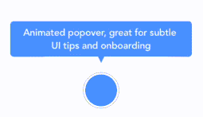

<p align="center">
  
</p>

[](https://travis-ci.org/andreamazz/AMPopTip)
[](https://coveralls.io/r/andreamazz/AMPopTip)
[](http://cocoapods.org/?q=ampoptip)
[](http://cocoadocs.org/docsets/AMPopTip)
[](https://github.com/Carthage/Carthage)
[](https://gitter.im/andreamazz/AMPopTip?utm_source=badge&utm_medium=badge&utm_campaign=pr-badge&utm_content=badge)

Animated popover that pops out of a frame. You can specify the direction of the popover and the arrow that points to its origin. Color, border radius and font can be easily customized. 
This popover can be used to leave subtle hints about your UI and provide fun looking onboarding popups.  

<p align="center">
  <a href='https://appetize.io/app/g7x2pwb9jtxdpz9yjb2p5wzk6g' alt='Live demo'>
    
  </a>
</p>

#Screenshot


#Setup with CocoaPods
* Add ```pod 'AMPopTip'``` to your ```Podfile```
* Run ```pod install```
* Run ```open App.xcworkspace```

#Setup with Carthage
* Add ```github "andreamazz/AMPopTip"```
* Run ```carthage update```
* Add ```AMPopTip.framework``` in your project

#Usage
The API is fairly straight forward, you can show and hide the popover at any time.

##Showing the popover
You must specify the text that you want to display alongside the popover direction, its max width, the view that will contain it and the frame of the view that the popover's arrow will point to.

####Objective-C

```objc
self.popTip = [AMPopTip popTip];
[self.popTip showText:@"I'm a popover popping over" direction:AMPopTipDirectionUp maxWidth:200 inView:self.view fromFrame:someView.frame];
```

####Swift

```swift
let popTip = AMPopTip()
popTip.showText("Hello", direction: .Up, maxWidth: 200, inView: self.view, fromFrame: someView.frame)
```

You can also display the popover in the center, with no arrow, in this case the `fromFrame` parameter will be the whole view:
```objc
[self.popTip showText:@"I'm a popover" direction:AMPopTipDirectionNone maxWidth:200 inView:self.view fromFrame:self.view.frame];
```

##Coordinate system
Please note that the frame you are intended to provide needs to refer to the absolute coordinate system of the view you are presenting the popover in. This means that if you are presenting the popover in a view, pointing to a nested subview, you'll need to convert its frame using UIKit's `convertRect(_:toView:)`. Read the reference [here](https://developer.apple.com/library/ios/documentation/UIKit/Reference/UIView_Class/#//apple_ref/occ/instm/UIView/convertRect:toView:).

##Showing a custom view
You can provide a custom view that will be wrapped in the poptip and presented.

####Objective-C

```objc
UIView *cutomView = [[UIView alloc] initWithFrame:CGRectMake(0, 0, 100, 100)];
// Configure your view
[self.popTip showCustomView:customView direction:AMPopTipDirectionDown inView:self.view fromFrame:self.view.frame];
```

####Swift

```swift
let customView = UIView(frame: CGRect(x: 0, y: 0, width: 100, height: 100))
// Configure your view
popTip.showCustomView(view, direction: .Down, inView: self.view, fromFrame: self.view.frame)
```

##Dismissing the popover
You can hide the popover by calling:
```objc
[self.popTip hide];
```
Or you can specify the duration of the popover:
```objc
[self.popTip showText:@"I'm a popover popping over" direction:AMPopTipDirectionUp maxWidth:200 inView:self.view fromFrame:someView.frame duration:3];
```
You can also let the user dismiss the popover by tapping on it:
```objc
self.popTip.shouldDismissOnTap = YES;
```
You can add a block that will be fired when the user taps the popover...
```objc
self.popTip.tapHandler = ^{
     NSLog(@"Popover selected!");
};
```
... when the popover is shown...
```objc
self.popTip.appearHandler = ^{
    NSLog(@"Appeared!");
};
```

... or when the popover is dismissed:
```objc
self.popTip.dismissHandler = ^{
    NSLog(@"Dismissed!");
};
```

#Custom entrance animation
You can choose which animation should be performed when the poptip is displayed:
```objc
self.popTip.entranceAnimation = AMPopTipEntranceAnimationScale;
```
Available animations:
```objc
AMPopTipEntranceAnimationScale,
AMPopTipEntranceAnimationTransition,
AMPopTipEntranceAnimationNone,
AMPopTipEntranceAnimationCustom
```

##AMPopTipEntranceAnimationCustom
You can provide your own animation block when using `AMPopTipEntranceAnimationCustom`:
```objc
self.popTip.entranceAnimation = AMPopTipEntranceAnimationCustom;
__weak AMViewController *weakSelf = self;
self.popTip.entranceAnimationHandler = ^(void (^completion)(void)){
    // Setup the animation
    weakSelf.popTip.transform = CGAffineTransformMakeRotation(M_PI);
    [UIView animateWithDuration:0.5 delay:0 usingSpringWithDamping:0.6 initialSpringVelocity:1.5 options:(UIViewAnimationOptionCurveEaseInOut) animations:^{
        weakSelf.popTip.transform = CGAffineTransformIdentity;
    } completion:^(BOOL done){
        completion();
    }];
}; 
```
This sample makes the poptip rotate on entrance. Make sure to call the completion block when the animation is done. Also note that the animation is fired as soon as the poptip is added as subview.

#Action animations
Action animations are subtle animations that can be performed to get the user's attention. 
Set your preferred animation:
```objc
self.popTip.actionAnimation = AMPopTipActionAnimationBounce;
```
Available animations:
```objc
AMPopTipActionAnimationBounce,
AMPopTipActionAnimationFloat,
AMPopTipActionAnimationPulse,
AMPopTipActionAnimationNone
```
The animation is fired as soon as the popover enters the scene and completes its entrance animation.



#Customization
Use the appearance proxy to customize the popover before creating the instance, or just use its public properties:
```objc
AMPopTip *appearance = [AMPopTip appearance];
appearance.font = <#UIFont#>;
appearance.textColor = <#UIColor#>;
appearance.textAlignment = NSTextAlignmentLeft;
appearance.popoverColor = <#UIColor#>;
appearance.borderColor = <#UIColor#>;
appearance.borderWidth = <#CGFloat#>;
appearance.radius = <#CGFloat#>; // Popover's border radius
appearance.rounded = <#BOOL#>; // If set to YES the radius will equal frame.height / 2
appearance.offset = <#CGFloat#>; // Offset between the popover and the origin
appearance.padding = <#CGFloat#>;
appearance.edgeInsets = <#UIEdgeInsets#>;
appearance.arrowSize = <#CGSize#>;
appearance.animationIn = <#NSTimeInterval#>;
appearance.animationOut = <#NSTimeInterval#>;
appearance.delayIn = <#NSTimeInterval#>;
appearance.delayOut = <#NSTimeInterval#>;
appearance.entranceAnimation = <#AMPopTipEntranceAnimation#>;
appearance.actionAnimation = <#AMPopTipActionAnimation#>;
appearance.actionFloatOffset = <#CGFloat#>;
appearance.actionBounceOffset = <#CGFloat#>;
appearance.actionPulseOffset = <#CGFloat#>;
appearance.actionAnimationIn = <#NSTimeInterval#>;
appearance.actionAnimationOut = <#NSTimeInterval#>;
appearance.actionDelayIn = <#NSTimeInterval#>;
appearance.actionDelayOut = <#NSTimeInterval#>;
appearance.edgeMargin = <#CGFloat#>;
```

#Author
[Andrea Mazzini](https://twitter.com/theandreamazz). I'm available for freelance work, feel free to contact me. 

Want to support the development of [these free libraries](https://cocoapods.org/owners/734)? Buy me a coffee ☕️ via [Paypal](https://www.paypal.me/andreamazzini).  

#Contributors
Thanks to [everyone](https://github.com/andreamazz/AMPopTip/graphs/contributors) kind enough to submit a pull request. 

#MIT License

	Copyright (c) 2015 Andrea Mazzini. All rights reserved.

	Permission is hereby granted, free of charge, to any person obtaining a
	copy of this software and associated documentation files (the "Software"),
	to deal in the Software without restriction, including
	without limitation the rights to use, copy, modify, merge, publish,
	distribute, sublicense, and/or sell copies of the Software, and to
	permit persons to whom the Software is furnished to do so, subject to
	the following conditions:

	The above copyright notice and this permission notice shall be included
	in all copies or substantial portions of the Software.

	THE SOFTWARE IS PROVIDED "AS IS", WITHOUT WARRANTY OF ANY KIND, EXPRESS
	OR IMPLIED, INCLUDING BUT NOT LIMITED TO THE WARRANTIES OF
	MERCHANTABILITY, FITNESS FOR A PARTICULAR PURPOSE AND NONINFRINGEMENT.
	IN NO EVENT SHALL THE AUTHORS OR COPYRIGHT HOLDERS BE LIABLE FOR ANY
	CLAIM, DAMAGES OR OTHER LIABILITY, WHETHER IN AN ACTION OF CONTRACT,
	TORT OR OTHERWISE, ARISING FROM, OUT OF OR IN CONNECTION WITH THE
	SOFTWARE OR THE USE OR OTHER DEALINGS IN THE SOFTWARE.
	
